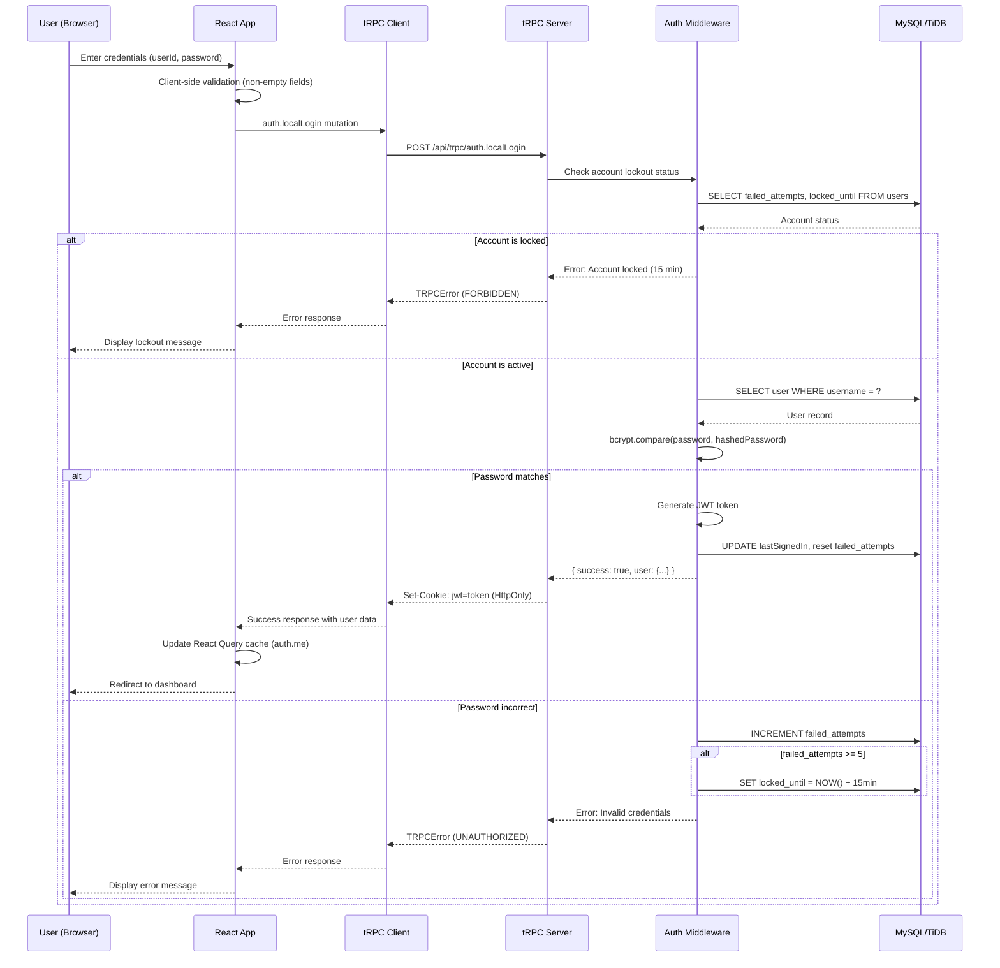
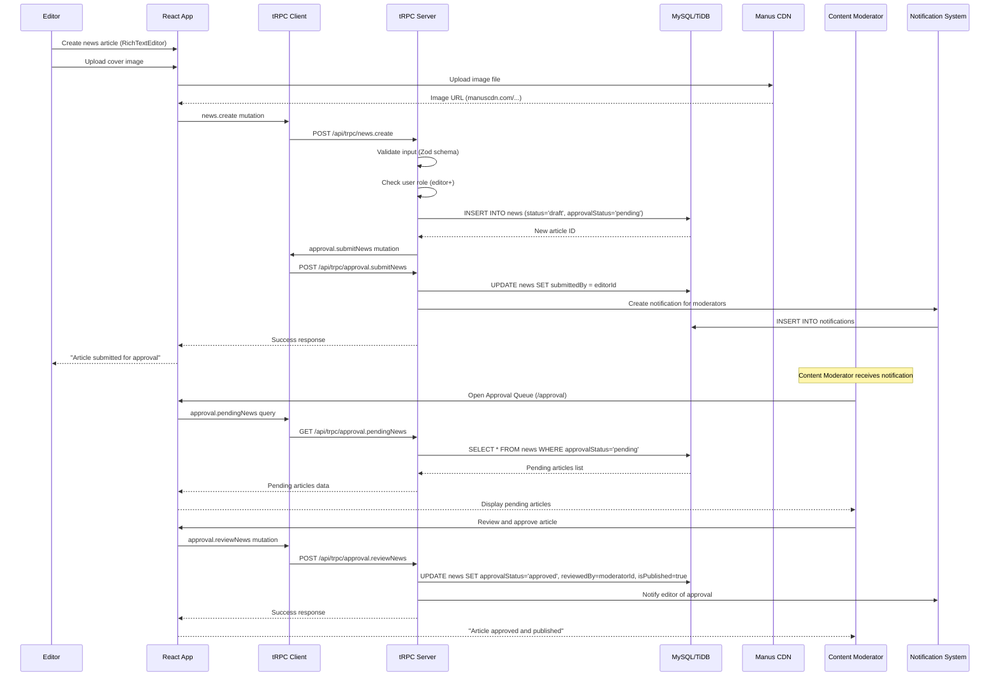
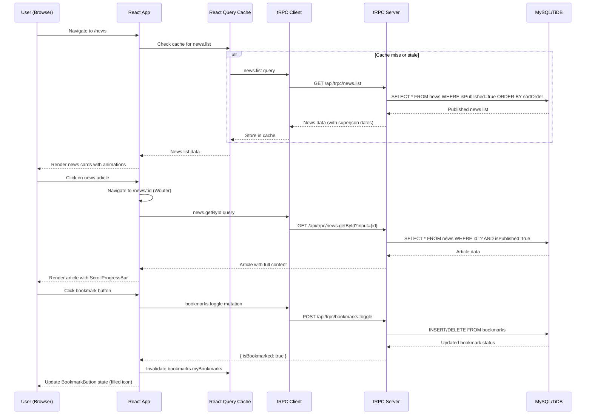
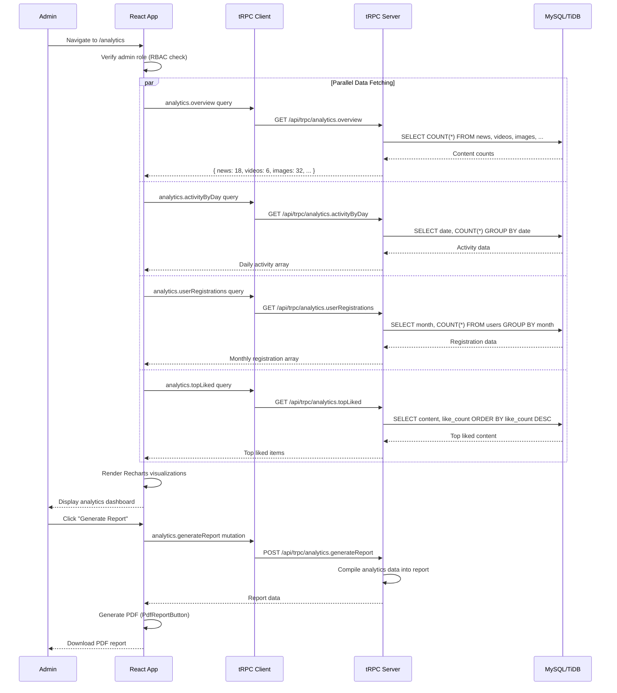
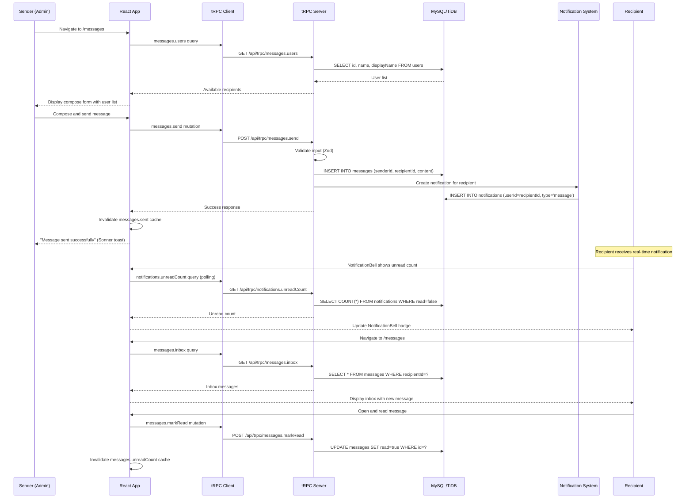

# Data Flow and Interaction Diagrams

This document traces the execution paths and data flows for five core use cases of the Rasid National Platform. Each use case is illustrated with a Mermaid.js sequence diagram and accompanied by a detailed explanation of the interaction between system components.

## 1. User Authentication (Login)

The login flow demonstrates the JWT-based authentication mechanism, including account lockout protection after failed attempts.

The authentication flow begins when the user submits their credentials through the `LoginPage` component. The React application performs basic client-side validation before dispatching the `auth.localLogin` tRPC mutation. On the server side, the auth middleware first checks whether the account is currently locked due to excessive failed attempts. If the account is active, the middleware retrieves the user record from the database and compares the submitted password against the stored bcrypt hash. Upon successful authentication, a JWT token is generated and set as an HTTP-only cookie, and the user is redirected to their role-appropriate dashboard.

## 2. Content Creation and Approval Workflow

This use case illustrates the complete lifecycle of a news article, from creation by an Editor through approval by a Content Moderator to publication.

The content creation workflow demonstrates the platform's multi-step approval process. An Editor uses the Tiptap-based `RichTextEditor` to compose an article, uploads a cover image to Manus CDN, and submits the article for review. The article is stored in the database with a `draft` status and `pending` approval status. A notification is sent to Content Moderators, who can review the article through the dedicated Approval Queue page. Upon approval, the article's status is updated to `approved` and `isPublished` is set to `true`, making it visible on the public news listing.

## 3. Content Browsing and Interaction

This use case shows how a public user browses news content and interacts with it through bookmarking and commenting.

The content browsing flow leverages React Query's caching mechanism for optimal performance. When a user navigates to the news listing, the application first checks the local cache for existing data. If the cache is empty or stale, a fresh query is dispatched to the tRPC server. The server retrieves only published articles, ordered by their configured sort order. When the user clicks on an article, the detail view is loaded with the full content, and the `ScrollProgressBar` component tracks reading progress. User interactions such as bookmarking trigger optimistic UI updates followed by server-side persistence.

## 4. Administrative Analytics Review

This use case demonstrates how an administrator accesses and reviews platform analytics.

The analytics dashboard demonstrates parallel data fetching, where multiple tRPC queries are dispatched simultaneously to populate different sections of the dashboard. React Query manages these parallel requests efficiently, rendering each chart as its data becomes available. The `Recharts` library renders the data as interactive visualizations. Administrators can generate comprehensive PDF reports using the `PdfReportButton` component.

## 5. Internal Messaging

This use case illustrates the internal messaging system, including direct messaging and broadcast functionality.

The messaging system provides both direct and broadcast communication capabilities. When an administrator composes a message, the `messages.users` query populates the recipient selector with all registered users. Upon sending, the message is persisted in the database and a notification is created for the recipient. The `NotificationBell` component polls for unread notification counts, providing near-real-time awareness of new messages. The `RealtimeNotifications` component may also provide WebSocket-based instant notifications, though this could not be fully confirmed through static analysis alone.
