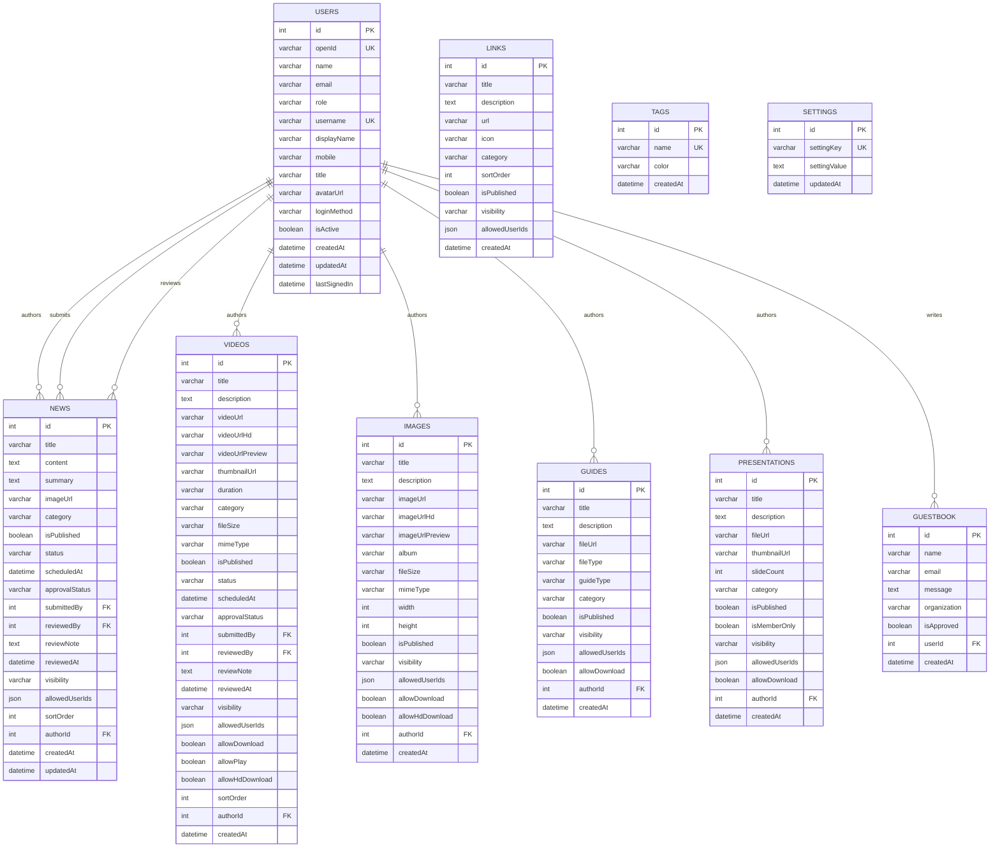

# Database Schema and Design

This document presents the complete database schema of the Rasid National Platform, reconstructed through reverse engineering of the tRPC API responses and JavaScript bundle analysis. The platform uses MySQL/TiDB as its relational database engine, accessed through Drizzle ORM.

## 1. Entity-Relationship Diagram

## 2. Table Specifications

### 2.1. Users Table

The `users` table stores all user account information, authentication credentials, and profile data. It supports both local authentication (username/password) and external OAuth-based login methods.

| Column | Data Type | Constraints | Description |
|:---|:---|:---|:---|
| `id` | INT | PRIMARY KEY, AUTO_INCREMENT | Unique user identifier |
| `openId` | VARCHAR(255) | UNIQUE, NOT NULL | External authentication identifier (format: `{method}_{username}`) |
| `name` | VARCHAR(255) | NOT NULL | Full legal name of the user |
| `email` | VARCHAR(255) | NOT NULL | Email address |
| `role` | VARCHAR(50) | NOT NULL, DEFAULT 'user' | User role: `admin`, `content_moderator`, `editor`, `viewer`, `user`, `moderator`, `member` |
| `username` | VARCHAR(100) | UNIQUE | Login username (for local auth) |
| `displayName` | VARCHAR(255) | | Display name shown in the UI |
| `mobile` | VARCHAR(20) | | Mobile phone number |
| `title` | VARCHAR(255) | | Job title or position |
| `avatarUrl` | VARCHAR(500) | | URL to the user's avatar image |
| `loginMethod` | VARCHAR(50) | DEFAULT 'local' | Authentication method: `local`, `oauth` |
| `isActive` | BOOLEAN | DEFAULT true | Whether the account is active |
| `createdAt` | DATETIME | NOT NULL, DEFAULT NOW() | Account creation timestamp |
| `updatedAt` | DATETIME | | Last profile update timestamp |
| `lastSignedIn` | DATETIME | | Last successful login timestamp |

### 2.2. News Table

The `news` table stores news articles with full content management lifecycle support, including drafting, approval workflows, scheduling, and visibility controls.

| Column | Data Type | Constraints | Description |
|:---|:---|:---|:---|
| `id` | INT | PRIMARY KEY, AUTO_INCREMENT | Unique article identifier |
| `title` | VARCHAR(500) | NOT NULL | Article headline |
| `content` | TEXT | NOT NULL | Full article content (HTML from Tiptap editor) |
| `summary` | TEXT | | Brief summary or excerpt |
| `imageUrl` | VARCHAR(500) | | Cover image URL (Manus CDN) |
| `category` | VARCHAR(100) | | Content category |
| `isPublished` | BOOLEAN | DEFAULT false | Whether the article is publicly visible |
| `status` | VARCHAR(50) | DEFAULT 'draft' | Lifecycle status: `draft`, `published`, `archived` |
| `scheduledAt` | DATETIME | | Scheduled publication date/time |
| `approvalStatus` | VARCHAR(50) | DEFAULT 'pending' | Approval status: `pending`, `approved`, `rejected` |
| `submittedBy` | INT | FK → users.id | User who submitted for approval |
| `reviewedBy` | INT | FK → users.id | Moderator who reviewed the submission |
| `reviewNote` | TEXT | | Moderator's review comments |
| `reviewedAt` | DATETIME | | Timestamp of the review |
| `visibility` | VARCHAR(50) | DEFAULT 'public' | Visibility level: `public`, `members`, `restricted` |
| `allowedUserIds` | JSON | | Array of user IDs with access (for restricted visibility) |
| `sortOrder` | INT | DEFAULT 0 | Display order on the listing page |
| `authorId` | INT | FK → users.id, NOT NULL | Author of the article |
| `createdAt` | DATETIME | NOT NULL, DEFAULT NOW() | Creation timestamp |
| `updatedAt` | DATETIME | | Last modification timestamp |

### 2.3. Videos Table

The `videos` table manages video content with support for multiple quality tiers, download controls, and the same approval workflow as news articles.

| Column | Data Type | Constraints | Description |
|:---|:---|:---|:---|
| `id` | INT | PRIMARY KEY, AUTO_INCREMENT | Unique video identifier |
| `title` | VARCHAR(500) | NOT NULL | Video title |
| `description` | TEXT | | Video description |
| `videoUrl` | VARCHAR(500) | NOT NULL | Standard quality video URL |
| `videoUrlHd` | VARCHAR(500) | | High-definition video URL |
| `videoUrlPreview` | VARCHAR(500) | | Preview/trailer video URL |
| `thumbnailUrl` | VARCHAR(500) | | Video thumbnail image URL |
| `duration` | VARCHAR(20) | | Video duration (e.g., "05:30") |
| `category` | VARCHAR(100) | | Content category |
| `fileSize` | VARCHAR(50) | | File size (e.g., "150MB") |
| `mimeType` | VARCHAR(50) | | MIME type (e.g., "video/mp4") |
| `isPublished` | BOOLEAN | DEFAULT false | Public visibility flag |
| `status` | VARCHAR(50) | DEFAULT 'draft' | Lifecycle status |
| `scheduledAt` | DATETIME | | Scheduled publication date |
| `approvalStatus` | VARCHAR(50) | DEFAULT 'pending' | Approval workflow status |
| `submittedBy` | INT | FK → users.id | Submitter user ID |
| `reviewedBy` | INT | FK → users.id | Reviewer user ID |
| `reviewNote` | TEXT | | Review comments |
| `reviewedAt` | DATETIME | | Review timestamp |
| `visibility` | VARCHAR(50) | DEFAULT 'public' | Visibility level |
| `allowedUserIds` | JSON | | Restricted access user IDs |
| `allowDownload` | BOOLEAN | DEFAULT false | Whether download is permitted |
| `allowPlay` | BOOLEAN | DEFAULT true | Whether playback is permitted |
| `allowHdDownload` | BOOLEAN | DEFAULT false | Whether HD download is permitted |
| `sortOrder` | INT | DEFAULT 0 | Display order |
| `authorId` | INT | FK → users.id, NOT NULL | Content author |
| `createdAt` | DATETIME | NOT NULL, DEFAULT NOW() | Creation timestamp |

### 2.4. Images Table

| Column | Data Type | Constraints | Description |
|:---|:---|:---|:---|
| `id` | INT | PRIMARY KEY, AUTO_INCREMENT | Unique image identifier |
| `title` | VARCHAR(500) | NOT NULL | Image title |
| `description` | TEXT | | Image description |
| `imageUrl` | VARCHAR(500) | NOT NULL | Standard resolution image URL |
| `imageUrlHd` | VARCHAR(500) | | High-definition image URL |
| `imageUrlPreview` | VARCHAR(500) | | Preview/thumbnail URL |
| `album` | VARCHAR(255) | | Album or collection name |
| `fileSize` | VARCHAR(50) | | File size |
| `mimeType` | VARCHAR(50) | | MIME type (e.g., "image/png") |
| `width` | INT | | Image width in pixels |
| `height` | INT | | Image height in pixels |
| `isPublished` | BOOLEAN | DEFAULT false | Public visibility flag |
| `visibility` | VARCHAR(50) | DEFAULT 'public' | Visibility level |
| `allowedUserIds` | JSON | | Restricted access user IDs |
| `allowDownload` | BOOLEAN | DEFAULT false | Download permission |
| `allowHdDownload` | BOOLEAN | DEFAULT false | HD download permission |
| `authorId` | INT | FK → users.id, NOT NULL | Uploader user ID |
| `createdAt` | DATETIME | NOT NULL, DEFAULT NOW() | Upload timestamp |

### 2.5. Guides Table

| Column | Data Type | Constraints | Description |
|:---|:---|:---|:---|
| `id` | INT | PRIMARY KEY, AUTO_INCREMENT | Unique guide identifier |
| `title` | VARCHAR(500) | NOT NULL | Guide title |
| `description` | TEXT | | Guide description |
| `fileUrl` | VARCHAR(500) | NOT NULL | File URL (PDF, DOCX, etc.) |
| `fileType` | VARCHAR(50) | | File type extension |
| `guideType` | VARCHAR(100) | | Guide classification type |
| `category` | VARCHAR(100) | | Content category |
| `isPublished` | BOOLEAN | DEFAULT false | Public visibility flag |
| `visibility` | VARCHAR(50) | DEFAULT 'public' | Visibility level |
| `allowedUserIds` | JSON | | Restricted access user IDs |
| `allowDownload` | BOOLEAN | DEFAULT true | Download permission |
| `authorId` | INT | FK → users.id, NOT NULL | Author user ID |
| `createdAt` | DATETIME | NOT NULL, DEFAULT NOW() | Creation timestamp |

### 2.6. Presentations Table

| Column | Data Type | Constraints | Description |
|:---|:---|:---|:---|
| `id` | INT | PRIMARY KEY, AUTO_INCREMENT | Unique presentation identifier |
| `title` | VARCHAR(500) | NOT NULL | Presentation title |
| `description` | TEXT | | Presentation description |
| `fileUrl` | VARCHAR(500) | NOT NULL | Presentation file URL |
| `thumbnailUrl` | VARCHAR(500) | | Cover slide thumbnail URL |
| `slideCount` | INT | | Number of slides |
| `category` | VARCHAR(100) | | Content category |
| `isPublished` | BOOLEAN | DEFAULT false | Public visibility flag |
| `isMemberOnly` | BOOLEAN | DEFAULT false | Member-exclusive access flag |
| `visibility` | VARCHAR(50) | DEFAULT 'public' | Visibility level |
| `allowedUserIds` | JSON | | Restricted access user IDs |
| `allowDownload` | BOOLEAN | DEFAULT false | Download permission |
| `authorId` | INT | FK → users.id, NOT NULL | Author user ID |
| `createdAt` | DATETIME | NOT NULL, DEFAULT NOW() | Creation timestamp |

### 2.7. Links Table

| Column | Data Type | Constraints | Description |
|:---|:---|:---|:---|
| `id` | INT | PRIMARY KEY, AUTO_INCREMENT | Unique link identifier |
| `title` | VARCHAR(500) | NOT NULL | Link display title |
| `description` | TEXT | | Link description |
| `url` | VARCHAR(1000) | NOT NULL | Target URL |
| `icon` | VARCHAR(100) | | Icon identifier or URL |
| `category` | VARCHAR(100) | | Link category |
| `sortOrder` | INT | DEFAULT 0 | Display order |
| `isPublished` | BOOLEAN | DEFAULT false | Public visibility flag |
| `visibility` | VARCHAR(50) | DEFAULT 'public' | Visibility level |
| `allowedUserIds` | JSON | | Restricted access user IDs |
| `createdAt` | DATETIME | NOT NULL, DEFAULT NOW() | Creation timestamp |

### 2.8. Guestbook Table

| Column | Data Type | Constraints | Description |
|:---|:---|:---|:---|
| `id` | INT | PRIMARY KEY, AUTO_INCREMENT | Unique entry identifier |
| `name` | VARCHAR(255) | NOT NULL | Visitor's name |
| `email` | VARCHAR(255) | | Visitor's email address |
| `message` | TEXT | NOT NULL | Guestbook message |
| `organization` | VARCHAR(255) | | Visitor's organization |
| `isApproved` | BOOLEAN | DEFAULT false | Moderation approval status |
| `userId` | INT | FK → users.id | Associated user ID (if logged in) |
| `createdAt` | DATETIME | NOT NULL, DEFAULT NOW() | Submission timestamp |

### 2.9. Tags Table

| Column | Data Type | Constraints | Description |
|:---|:---|:---|:---|
| `id` | INT | PRIMARY KEY, AUTO_INCREMENT | Unique tag identifier |
| `name` | VARCHAR(100) | UNIQUE, NOT NULL | Tag name |
| `color` | VARCHAR(20) | | Display color (hex code) |
| `createdAt` | DATETIME | NOT NULL, DEFAULT NOW() | Creation timestamp |

### 2.10. Settings Table

| Column | Data Type | Constraints | Description |
|:---|:---|:---|:---|
| `id` | INT | PRIMARY KEY, AUTO_INCREMENT | Unique setting identifier |
| `settingKey` | VARCHAR(100) | UNIQUE, NOT NULL | Configuration key name |
| `settingValue` | TEXT | | Configuration value |
| `updatedAt` | DATETIME | | Last modification timestamp |

## 3. Design Patterns

### 3.1. Common Column Patterns

Several design patterns are consistently applied across content tables.

**Visibility and Access Control.** All content tables include a `visibility` column (with values `public`, `members`, `restricted`) and an `allowedUserIds` JSON column. This dual-layer approach provides both broad category-based access control and fine-grained per-user restrictions.

**Content Lifecycle.** The `news` and `videos` tables implement a full content lifecycle with `status` (draft/published/archived), `approvalStatus` (pending/approved/rejected), `scheduledAt` (future publication), and audit fields (`submittedBy`, `reviewedBy`, `reviewedAt`, `reviewNote`).

**Media Quality Tiers.** Both `images` and `videos` tables support multiple quality tiers (standard, HD, preview) with separate URL columns and download permission flags for each tier.

**Soft Ordering.** Content tables include a `sortOrder` integer column, enabling administrators to manually control the display order of items through the Content Order management page.

### 3.2. Inferred Additional Tables

Based on the tRPC API procedures discovered but not directly visible in list/all queries, the following additional tables are inferred to exist in the database.

| Inferred Table | Evidence | Probable Columns |
|:---|:---|:---|
| `bookmarks` | `bookmarks.toggle`, `bookmarks.myBookmarks`, `bookmarks.isBookmarked` | id, userId, contentType, contentId, createdAt |
| `notifications` | `notifications.list`, `notifications.unreadCount`, `notifications.markRead` | id, userId, type, message, isRead, createdAt |
| `messages` | `messages.inbox`, `messages.sent`, `messages.send` | id, senderId, recipientId, subject, content, isRead, createdAt |
| `activity_log` | `ActivityLogPage` component | id, userId, action, entityType, entityId, details, createdAt |
| `comments` | `CommentsSection` component | id, userId, contentType, contentId, content, createdAt |
| `likes` | `LikeButton` component, `analytics.likesByType` | id, userId, contentType, contentId, createdAt |
| `weekly_report_settings` | `weeklyReport.getSettings` | id, enabled, dayOfWeek, hour, recipients (JSON) |
