# مخططات تدفق البيانات والتفاعل

يتتبع هذا المستند مسارات التنفيذ وتدفقات البيانات لخمس حالات استخدام أساسية لمنصة راصد الوطنية. يتم توضيح كل حالة استخدام بمخطط تسلسل Mermaid.js مصحوبًا بشرح مفصل للتفاعل بين مكونات النظام.

## 1. مصادقة المستخدم (تسجيل الدخول)

يوضح تدفق تسجيل الدخول آلية المصادقة القائمة على JWT، بما في ذلك حماية قفل الحساب بعد المحاولات الفاشلة.

```mermaid
sequenceDiagram
    participant U as المستخدم (المتصفح)
    participant R as تطبيق React
    participant T as عميل tRPC
    participant S as خادم tRPC
    participant M as برمجية المصادقة الوسيطة
    participant DB as MySQL/TiDB

    U->>R: إدخال بيانات الاعتماد (معرف المستخدم، كلمة المرور)
    R->>R: التحقق من جانب العميل (حقول غير فارغة)
    R->>T: تعديل auth.localLogin
    T->>S: POST /api/trpc/auth.localLogin
    S->>M: التحقق من حالة قفل الحساب
    M->>DB: SELECT failed_attempts, locked_until FROM users
    DB-->>M: حالة الحساب
    alt الحساب مقفل
        M-->>S: خطأ: الحساب مقفل (15 دقيقة)
        S-->>T: TRPCError (FORBIDDEN)
        T-->>R: استجابة خطأ
        R-->>U: عرض رسالة القفل
    else الحساب نشط
        M->>DB: SELECT user WHERE username = ?
        DB-->>M: سجل المستخدم
        M->>M: bcrypt.compare(password, hashedPassword)
        alt كلمة المرور متطابقة
            M->>M: إنشاء رمز JWT
            M->>DB: UPDATE lastSignedIn, reset failed_attempts
            M-->>S: { success: true, user: {...} }
            S-->>T: Set-Cookie: jwt=token (HttpOnly)
            T-->>R: استجابة نجاح مع بيانات المستخدم
            R->>R: تحديث ذاكرة التخزين المؤقت لـ React Query (auth.me)
            R-->>U: إعادة التوجيه إلى لوحة التحكم
        else كلمة المرور غير صحيحة
            M->>DB: INCREMENT failed_attempts
            alt failed_attempts >= 5
                M->>DB: SET locked_until = NOW() + 15min
            end
            M-->>S: خطأ: بيانات اعتماد غير صالحة
            S-->>T: TRPCError (UNAUTHORIZED)
            T-->>R: استجابة خطأ
            R-->>U: عرض رسالة خطأ
        end
    end
```

يبدأ تدفق المصادقة عندما يقدم المستخدم بيانات اعتماده من خلال مكون `LoginPage`. يقوم تطبيق React بإجراء تحقق أساسي من جانب العميل قبل إرسال تعديل `auth.localLogin` tRPC. على جانب الخادم، تتحقق برمجية المصادقة الوسيطة أولاً مما إذا كان الحساب مقفلاً حاليًا بسبب المحاولات الفاشلة المفرطة. إذا كان الحساب نشطًا، تسترد البرمجية الوسيطة سجل المستخدم من قاعدة البيانات وتقارن كلمة المرور المقدمة مقابل تجزئة bcrypt المخزنة. عند المصادقة الناجحة، يتم إنشاء رمز JWT وتعيينه كملف تعريف ارتباط HTTP-only، ويتم إعادة توجيه المستخدم إلى لوحة التحكم المناسبة لدوره.

## 2. سير عمل إنشاء المحتوى والموافقة عليه

توضح حالة الاستخدام هذه دورة الحياة الكاملة لمقال إخباري، من إنشائه بواسطة محرر مرورًا بموافقة مشرف المحتوى إلى النشر.

يوضح سير عمل إنشاء المحتوى عملية الموافقة متعددة الخطوات في المنصة. يستخدم المحرر محرر النصوص المنسقة `RichTextEditor` القائم على Tiptap لإنشاء مقال، وتحميل صورة غلاف إلى Manus CDN، وتقديم المقال للمراجعة. يتم تخزين المقال في قاعدة البيانات بحالة `draft` وحالة موافقة `pending`. يتم إرسال إشعار إلى مشرفي المحتوى، الذين يمكنهم مراجعة المقال من خلال صفحة قائمة انتظار الموافقة المخصصة. عند الموافقة، يتم تحديث حالة المقال إلى `approved` وتعيين `isPublished` إلى `true`، مما يجعله مرئيًا في قائمة الأخبار العامة.

## 3. تصفح المحتوى والتفاعل معه

توضح حالة الاستخدام هذه كيف يتصفح مستخدم عام محتوى الأخبار ويتفاعل معه من خلال الإشارات المرجعية والتعليقات.

يستفيد تدفق تصفح المحتوى من آلية التخزين المؤقت في React Query لتحقيق الأداء الأمثل. عندما ينتقل المستخدم إلى قائمة الأخبار، يتحقق التطبيق أولاً من ذاكرة التخزين المؤقت المحلية للبيانات الموجودة. إذا كانت ذاكرة التخزين المؤقت فارغة أو قديمة، يتم إرسال استعلام جديد إلى خادم tRPC. يسترد الخادم المقالات المنشورة فقط، مرتبة حسب ترتيب الفرز المكون. عندما ينقر المستخدم على مقال، يتم تحميل عرض التفاصيل مع المحتوى الكامل، ويتتبع مكون `ScrollProgressBar` تقدم القراءة. تؤدي تفاعلات المستخدم مثل الإشارات المرجعية إلى تحديثات متفائلة لواجهة المستخدم تليها استمرارية من جانب الخادم.

## 4. مراجعة التحليلات الإدارية

توضح حالة الاستخدام هذه كيف يصل المسؤول ويراجع تحليلات المنصة.

توضح لوحة معلومات التحليلات جلب البيانات بالتوازي، حيث يتم إرسال استعلامات tRPC متعددة في وقت واحد لملء أقسام مختلفة من لوحة المعلومات. يدير React Query هذه الطلبات المتوازية بكفاءة، ويعرض كل مخطط عند توفر بياناته. تعرض مكتبة `Recharts` البيانات كتصورات تفاعلية. يمكن للمسؤولين إنشاء تقارير PDF شاملة باستخدام مكون `PdfReportButton`.

## 5. المراسلة الداخلية

توضح حالة الاستخدام هذه نظام المراسلة الداخلي، بما في ذلك المراسلة المباشرة ووظيفة البث.

يوفر نظام المراسلة إمكانيات اتصال مباشر وبث. عندما يقوم مسؤول بإنشاء رسالة، يملأ استعلام `messages.users` محدد المستلم بجميع المستخدمين المسجلين. عند الإرسال، يتم الاحتفاظ بالرسالة في قاعدة البيانات ويتم إنشاء إشعار للمستلم. يستقصي مكون `NotificationBell` عن أعداد الإشعارات غير المقروءة، مما يوفر وعيًا شبه فوري بالرسائل الجديدة. قد يوفر مكون `RealtimeNotifications` أيضًا إشعارات فورية قائمة على WebSocket، على الرغم من أنه لا يمكن تأكيد ذلك بالكامل من خلال التحليل الثابت وحده.
