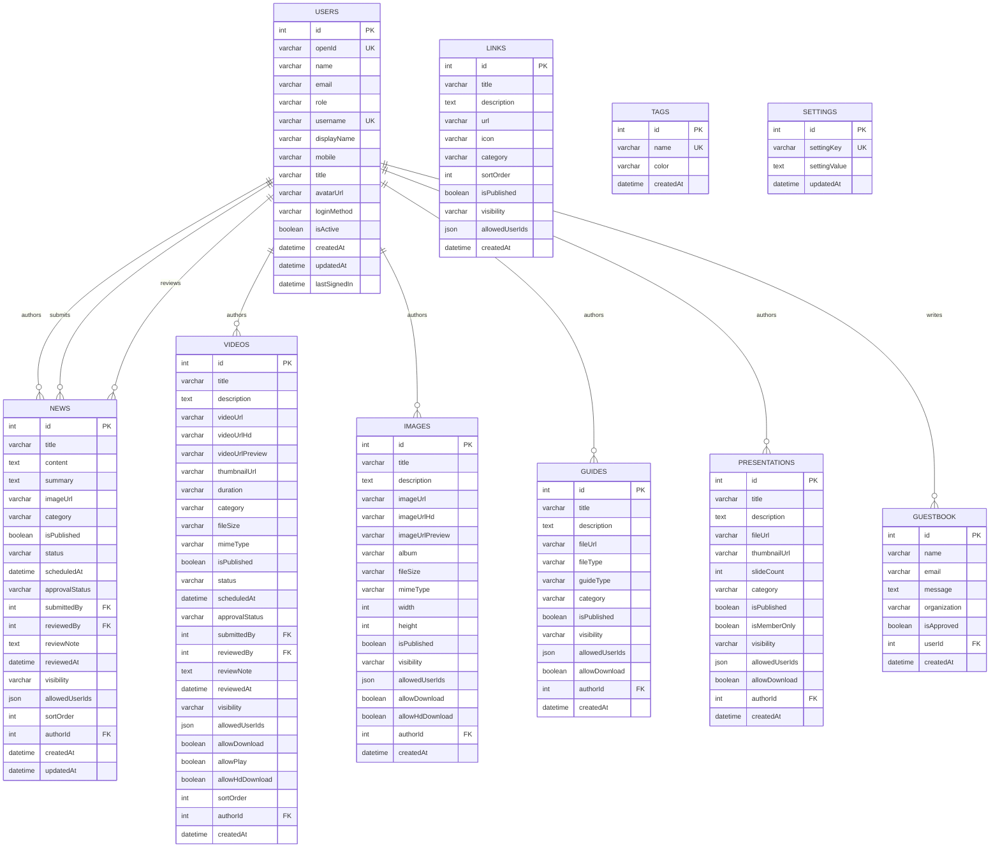

# مخطط قاعدة البيانات وتصميمها

يقدم هذا المستند مخطط قاعدة البيانات الكامل لمنصة راصد الوطنية، والذي أعيد بناؤه من خلال الهندسة العكسية لاستجابات واجهة برمجة التطبيقات tRPC وتحليل حزمة JavaScript. تستخدم المنصة MySQL/TiDB كمحرك لقاعدة البيانات العلائقية، ويتم الوصول إليه من خلال Drizzle ORM.

## 1. مخطط الكيان-العلاقة (ERD)

## 2. مواصفات الجداول

### 2.1. جدول المستخدمين (Users)

يخزن جدول `users` جميع معلومات حسابات المستخدمين وبيانات المصادقة وبيانات الملف الشخصي. وهو يدعم كلاً من المصادقة المحلية (اسم المستخدم/كلمة المرور) وطرق تسجيل الدخول المستندة إلى OAuth الخارجية.

| العمود | نوع البيانات | القيود | الوصف |
|:---|:---|:---|:---|
| `id` | INT | PRIMARY KEY, AUTO_INCREMENT | معرّف المستخدم الفريد |
| `openId` | VARCHAR(255) | UNIQUE, NOT NULL | معرّف المصادقة الخارجي (التنسيق: `{method}_{username}`) |
| `name` | VARCHAR(255) | NOT NULL | الاسم القانوني الكامل للمستخدم |
| `email` | VARCHAR(255) | NOT NULL | عنوان البريد الإلكتروني |
| `role` | VARCHAR(50) | NOT NULL, DEFAULT 'user' | دور المستخدم: `admin`, `content_moderator`, `editor`, `viewer`, `user`, `moderator`, `member` |
| `username` | VARCHAR(100) | UNIQUE | اسم مستخدم تسجيل الدخول (للمصادقة المحلية) |
| `displayName` | VARCHAR(255) | | اسم العرض الظاهر في واجهة المستخدم |
| `mobile` | VARCHAR(20) | | رقم الهاتف المحمول |
| `title` | VARCHAR(255) | | المسمى الوظيفي أو المنصب |
| `avatarUrl` | VARCHAR(500) | | رابط صورة الملف الشخصي للمستخدم |
| `loginMethod` | VARCHAR(50) | DEFAULT 'local' | طريقة المصادقة: `local`, `oauth` |
| `isActive` | BOOLEAN | DEFAULT true | ما إذا كان الحساب نشطًا |
| `createdAt` | DATETIME | NOT NULL, DEFAULT NOW() | الطابع الزمني لإنشاء الحساب |
| `updatedAt` | DATETIME | | الطابع الزمني لآخر تحديث للملف الشخصي |
| `lastSignedIn` | DATETIME | | الطابع الزمني لآخر تسجيل دخول ناجح |

### 2.2. جدول الأخبار (News)

يخزن جدول `news` المقالات الإخبارية مع دعم كامل لدورة حياة إدارة المحتوى، بما في ذلك الصياغة وسير عمل الموافقة والجدولة وضوابط الرؤية.

| العمود | نوع البيانات | القيود | الوصف |
|:---|:---|:---|:---|
| `id` | INT | PRIMARY KEY, AUTO_INCREMENT | معرّف المقال الفريد |
| `title` | VARCHAR(500) | NOT NULL | عنوان المقال |
| `content` | TEXT | NOT NULL | محتوى المقال الكامل (HTML من محرر Tiptap) |
| `summary` | TEXT | | ملخص موجز أو مقتطف |
| `imageUrl` | VARCHAR(500) | | رابط صورة الغلاف (Manus CDN) |
| `category` | VARCHAR(100) | | فئة المحتوى |
| `isPublished` | BOOLEAN | DEFAULT false | ما إذا كان المقال مرئيًا للعامة |
| `status` | VARCHAR(50) | DEFAULT 'draft' | حالة دورة الحياة: `draft`, `published`, `archived` |
| `scheduledAt` | DATETIME | | تاريخ/وقت النشر المجدول |
| `approvalStatus` | VARCHAR(50) | DEFAULT 'pending' | حالة الموافقة: `pending`, `approved`, `rejected` |
| `submittedBy` | INT | FK → users.id | المستخدم الذي قدم للموافقة |
| `reviewedBy` | INT | FK → users.id | المشرف الذي راجع الطلب |
| `reviewNote` | TEXT | | تعليقات مراجعة المشرف |
| `reviewedAt` | DATETIME | | الطابع الزمني للمراجعة |
| `visibility` | VARCHAR(50) | DEFAULT 'public' | مستوى الرؤية: `public`, `members`, `restricted` |
| `allowedUserIds` | JSON | | مصفوفة من معرفات المستخدمين الذين لديهم حق الوصول (للرؤية المقيدة) |
| `sortOrder` | INT | DEFAULT 0 | ترتيب العرض في صفحة القائمة |
| `authorId` | INT | FK → users.id, NOT NULL | مؤلف المقال |
| `createdAt` | DATETIME | NOT NULL, DEFAULT NOW() | الطابع الزمني للإنشاء |
| `updatedAt` | DATETIME | | الطابع الزمني لآخر تعديل |

### 2.3. جدول مقاطع الفيديو (Videos)

يدير جدول `videos` محتوى الفيديو مع دعم لمستويات جودة متعددة، وضوابط التنزيل، ونفس سير عمل الموافقة مثل المقالات الإخبارية.

| العمود | نوع البيانات | القيود | الوصف |
|:---|:---|:---|:---|
| `id` | INT | PRIMARY KEY, AUTO_INCREMENT | معرّف الفيديو الفريد |
| `title` | VARCHAR(500) | NOT NULL | عنوان الفيديو |
| `description` | TEXT | | وصف الفيديو |
| `videoUrl` | VARCHAR(500) | NOT NULL | رابط الفيديو بالجودة القياسية |
| `videoUrlHd` | VARCHAR(500) | | رابط الفيديو عالي الدقة |
| `videoUrlPreview` | VARCHAR(500) | | رابط فيديو المعاينة/المقطع الدعائي |
| `thumbnailUrl` | VARCHAR(500) | | رابط صورة مصغرة للفيديو |
| `duration` | VARCHAR(20) | | مدة الفيديو (على سبيل المثال، "05:30") |
| `category` | VARCHAR(100) | | فئة المحتوى |
| `fileSize` | VARCHAR(50) | | حجم الملف (على سبيل المثال، "150MB") |
| `mimeType` | VARCHAR(50) | | نوع MIME (على سبيل المثال، "video/mp4") |
| `isPublished` | BOOLEAN | DEFAULT false | علامة الرؤية العامة |
| `status` | VARCHAR(50) | DEFAULT 'draft' | حالة دورة الحياة |
| `scheduledAt` | DATETIME | | تاريخ النشر المجدول |
| `approvalStatus` | VARCHAR(50) | DEFAULT 'pending' | حالة سير عمل الموافقة |
| `submittedBy` | INT | FK → users.id | معرّف المستخدم الذي قدم الطلب |
| `reviewedBy` | INT | FK → users.id | معرّف المستخدم المراجع |
| `reviewNote` | TEXT | | تعليقات المراجعة |
| `reviewedAt` | DATETIME | | الطابع الزمني للمراجعة |
| `visibility` | VARCHAR(50) | DEFAULT 'public' | مستوى الرؤية |
| `allowedUserIds` | JSON | | معرفات المستخدمين للوصول المقيد |
| `allowDownload` | BOOLEAN | DEFAULT false | ما إذا كان التنزيل مسموحًا به |
| `allowPlay` | BOOLEAN | DEFAULT true | ما إذا كان التشغيل مسموحًا به |
| `allowHdDownload` | BOOLEAN | DEFAULT false | ما إذا كان تنزيل HD مسموحًا به |
| `sortOrder` | INT | DEFAULT 0 | ترتيب العرض |
| `authorId` | INT | FK → users.id, NOT NULL | مؤلف المحتوى |
| `createdAt` | DATETIME | NOT NULL, DEFAULT NOW() | الطابع الزمني للإنشاء |

### 2.4. جدول الصور (Images)

| العمود | نوع البيانات | القيود | الوصف |
|:---|:---|:---|:---|
| `id` | INT | PRIMARY KEY, AUTO_INCREMENT | معرّف الصورة الفريد |
| `title` | VARCHAR(500) | NOT NULL | عنوان الصورة |
| `description` | TEXT | | وصف الصورة |
| `imageUrl` | VARCHAR(500) | NOT NULL | رابط الصورة بالدقة القياسية |
| `imageUrlHd` | VARCHAR(500) | | رابط الصورة عالية الدقة |
| `imageUrlPreview` | VARCHAR(500) | | رابط المعاينة/الصورة المصغرة |
| `album` | VARCHAR(255) | | اسم الألبوم أو المجموعة |
| `fileSize` | VARCHAR(50) | | حجم الملف |
| `mimeType` | VARCHAR(50) | | نوع MIME (على سبيل المثال، "image/png") |
| `width` | INT | | عرض الصورة بالبكسل |
| `height` | INT | | ارتفاع الصورة بالبكسل |
| `isPublished` | BOOLEAN | DEFAULT false | علامة الرؤية العامة |
| `visibility` | VARCHAR(50) | DEFAULT 'public' | مستوى الرؤية |
| `allowedUserIds` | JSON | | معرفات المستخدمين للوصول المقيد |
| `allowDownload` | BOOLEAN | DEFAULT false | إذن التنزيل |
| `allowHdDownload` | BOOLEAN | DEFAULT false | إذن تنزيل HD |
| `authorId` | INT | FK → users.id, NOT NULL | معرّف المستخدم الذي قام بالتحميل |
| `createdAt` | DATETIME | NOT NULL, DEFAULT NOW() | الطابع الزمني للتحميل |

### 2.5. جدول الأدلة (Guides)

| العمود | نوع البيانات | القيود | الوصف |
|:---|:---|:---|:---|
| `id` | INT | PRIMARY KEY, AUTO_INCREMENT | معرّف الدليل الفريد |
| `title` | VARCHAR(500) | NOT NULL | عنوان الدليل |
| `description` | TEXT | | وصف الدليل |
| `fileUrl` | VARCHAR(500) | NOT NULL | رابط الملف (PDF, DOCX, إلخ) |
| `fileType` | VARCHAR(50) | | امتداد نوع الملف |
| `guideType` | VARCHAR(100) | | نوع الدليل |
| `category` | VARCHAR(100) | | فئة المحتوى |
| `isPublished` | BOOLEAN | DEFAULT false | علامة الرؤية العامة |
| `visibility` | VARCHAR(50) | DEFAULT 'public' | مستوى الرؤية |
| `allowedUserIds` | JSON | | معرفات المستخدمين للوصول المقيد |
| `allowDownload` | BOOLEAN | DEFAULT false | إذن التنزيل |
| `authorId` | INT | FK → users.id, NOT NULL | مؤلف المحتوى |
| `createdAt` | DATETIME | NOT NULL, DEFAULT NOW() | الطابع الزمني للإنشاء |
